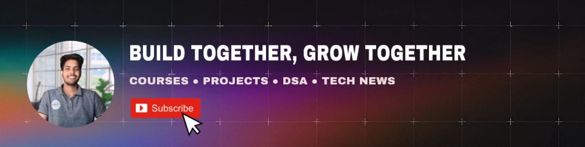

<a href="https://www.youtube.com/@RitikPrasad-lz8fk">
  <picture>
    <source media="(prefers-color-scheme: dark)" srcset="./rp_banner.jpeg" />
    <source media="(prefers-color-scheme: light)" srcset="./rp_banner.jpeg" />
    
  </picture>
</a>


<div align="center">
   
  <h3 align="center">Packed with Brain JS, Lang Chain, Node JS, Express and Mongo DB</h3>
   
  <div />
   
</div>


Welcome to the Reelzzz Server repository! This Node.js application serves as the backend for the Reelzzz project. Below, you'll find instructions on how to set up the development environment and configure necessary variables using the `.env` file.


## Installation

Before you begin, make sure you have Node.js and npm installed on your system. You can download and install them from [Node.js official website](https://nodejs.org/).

1. Clone this repository to your local machine:

```sh
   git clone https://github.com/Ritik5Prasad/Reelzzz_server.git
```

2. Navigate to the project directory:

```sh
   cd Reelzzz_server
 ```

3. Rename the `env_template` according to your need local or prod file to `.env`:

```sh
   mv env_template .env
  ```

## Configuration

Open the `.env` file in your favorite text editor and fill in the required details. If you're unsure about what to fill, you can refer to the following YouTube playlist for guidance: [Reelzz  YouTube Playlist](https://www.youtube.com/channel/UChQgXWG96_uPHj40gNh4MNg).


## Running the Server

Once you have configured the `.env` file, you can start the server by running:

```sh
npm install
npm start
```

This will install the necessary dependencies and start the server on the specified port.

## Contributing

If you'd like to contribute to this project, please fork the repository and create a pull request with your changes. We welcome any contributions, whether it's fixing bugs, adding features, or improving documentation.

## License

This project is licensed under the [MIT License](LICENSE), which means you are free to use, modify, and distribute the code as long as you include the original license in your distribution.

---

Happy coding! If you have any questions or need further assistance, feel free to reach out to us.
